# Network-Engineer-Exams

软考中级-网络工程师

- [Network-Engineer-Exams](#network-engineer-exams)
    - [视频教程](#视频教程)
    - [章节知识点与分值占比](#章节知识点与分值占比)
    - [部分知识点](#部分知识点)
      - [1000 Base](#1000-base)
      - [IS-IS协议](#is-is协议)
      - [局域网技术\>GVRP协议\>GVRP定时器](#局域网技术gvrp协议gvrp定时器)
      - [OSPF与RIP](#ospf与rip)
      - 
    - [下午题目](#下午题目)
    - [考前冲刺](#考前冲刺)
    - [泄题](#泄题)
    - [新版教材](#新版教材)
    - [参考答案与解析](#参考答案与解析)

### 视频教程

跟着老师刷视频

[bilibili summer课堂](https://space.bilibili.com/209743285)

[bilibili 网工老姜](https://www.bilibili.com/video/BV1Yi42127P8/)

### 章节知识点与分值占比

1. 计算机网络概论
2. 数据通信基础
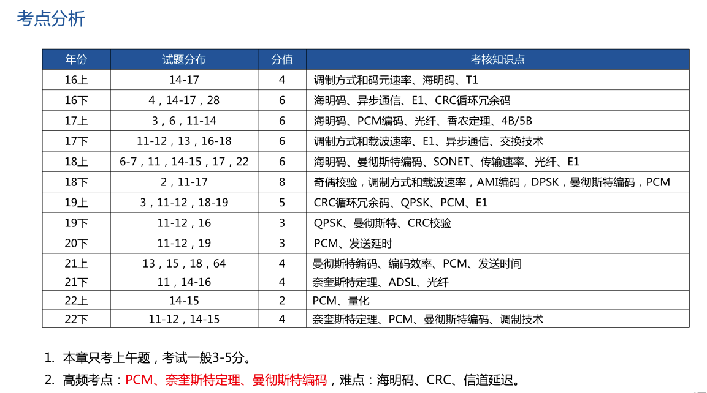
3. 广域通信网
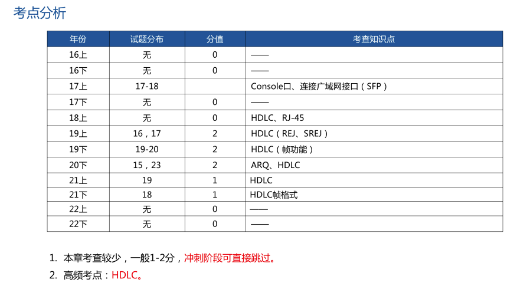
4. 局域网和城域网
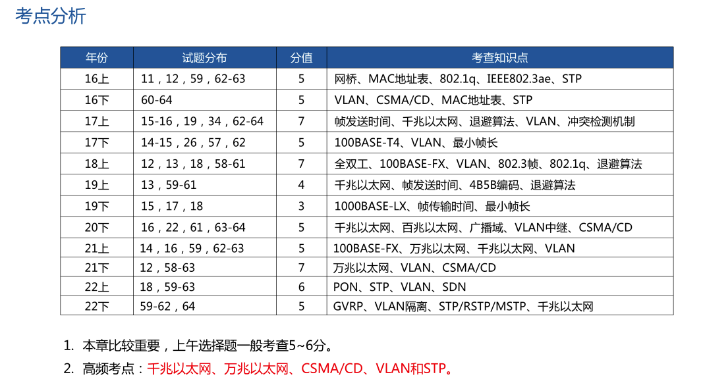
5. 无线通信网
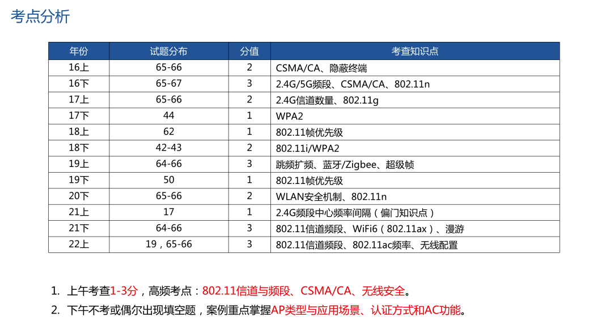
6. 网络互联与互联网
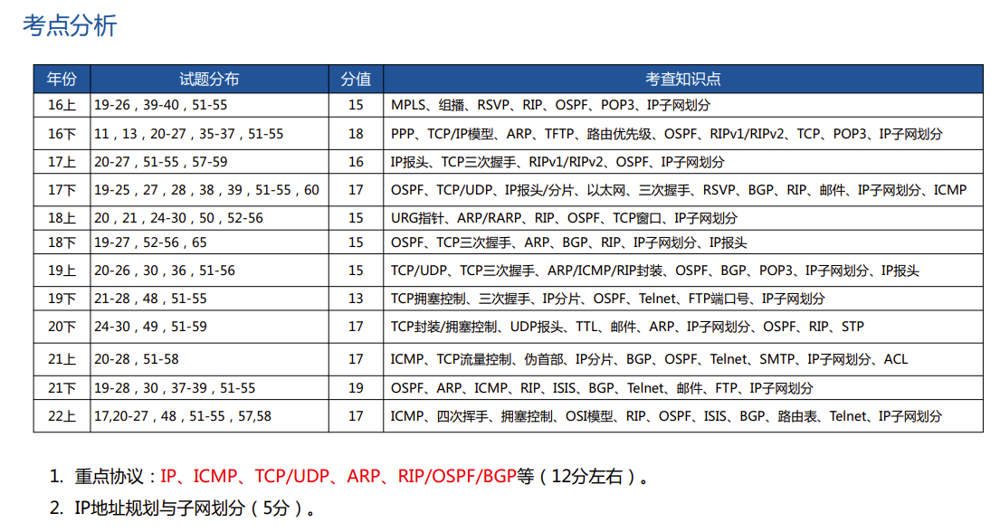
7. 下一代互联网
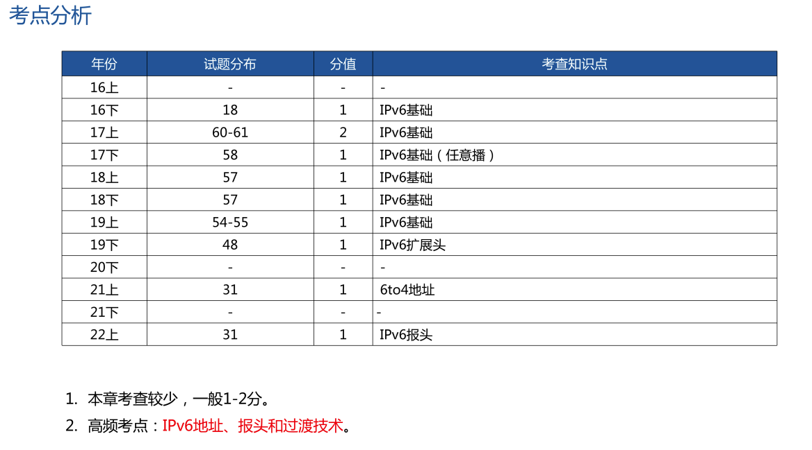
8. 网络安全
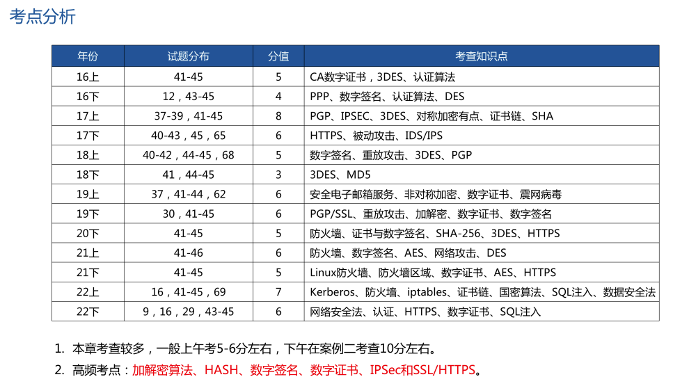
9. 网络操作西贡与应用服务器
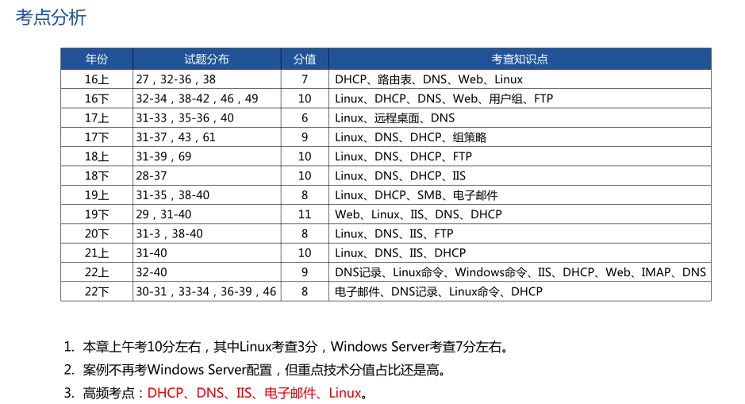
10. 组网技术
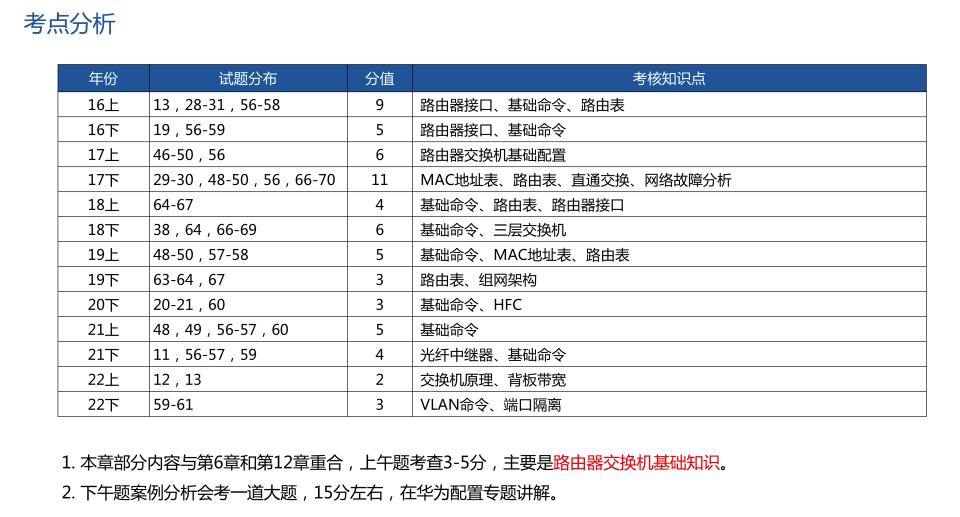
11. 网络管理
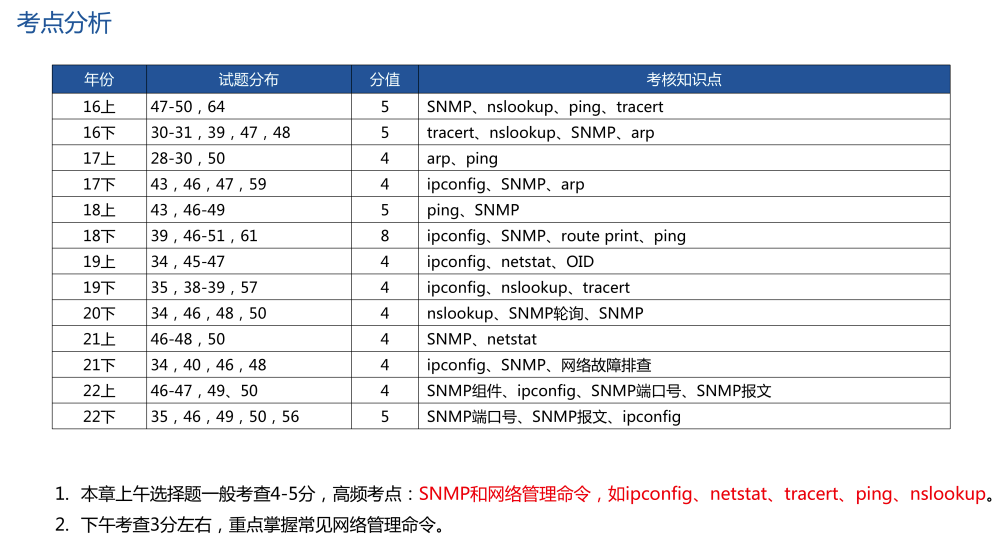
12. 网络规划设计
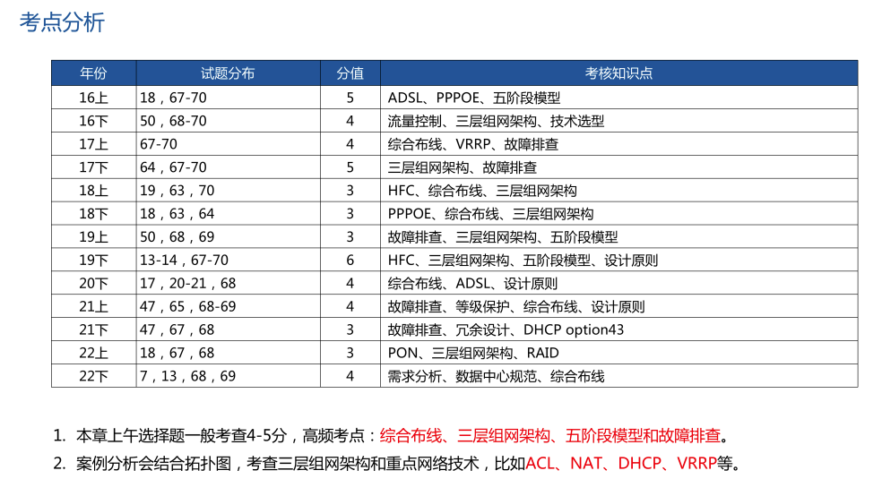

### 部分知识点

[简单理解TCP三次握手四次挥手](https://blog.csdn.net/m0_56649557/article/details/119492899)

[DNS域名详细解析过程(最全面，看这一篇就够)](https://blog.csdn.net/bangshao1989/article/details/121913780)

[CSMA/CD协议](https://blog.csdn.net/qq_46331050/article/details/120406217)

[ICMP协议详解和作用](https://blog.csdn.net/yuxiang1014/article/details/108547017)

[PGP详细内容整理](https://blog.csdn.net/qq_42248536/article/details/105805078)

[划分 VLAN 的作用是什么？](https://www.zhihu.com/question/19903686#)

[通俗易懂的对称加密与非对称加密原理浅析](https://juejin.cn/post/6964558725839339533)

[结构化综合布线系统（6个子系统）](https://blog.csdn.net/2302_79730293/article/details/142746139)

[802.11 a/b/g/n/ac 是什么以及它们有什么区别](https://blog.csdn.net/briant_ccj/article/details/50487303)

[数字签名和数字证书的原理解读(图文)](https://www.wosign.com/News/news_2018101101.htm)

[RAID6与RAID5数据安全性对比](https://support.huawei.com/enterprise/zh/knowledge/EKB1000149118)

[DAS、SAN、NAS三种存储方式的概念及应用](https://blog.csdn.net/qq_23348071/article/details/73963407)

[滑动窗口后退 N 帧协议 GBN](https://blog.csdn.net/shulianghan/article/details/108070859)

[选择重传协议 SR ](https://blog.csdn.net/shulianghan/article/details/108074861)

[EBGP vs IBGP](https://blog.csdn.net/u013185349/article/details/123394764)

[无线网常见的几种认证方式](https://blog.51cto.com/ccieh3c/4292446)

#### 1000 Base

- 1000 Base-T标准使用的是5类**非屏蔽双绞线**，双绞线长度可以达到100m。
- 1000 Base-X是基于光纤通道的物理层，使用的媒体有三种：
- 1000 Base-CX标准使用的是**屏蔽双绞线**，双绞线长度可以达到25m；
- 1000 Base-LX标准使用的是波长为1300nm的**单模光纤**，光纤长度可以达到3000m；
- 1000 Base-SX标准使用的是波长为850nm的多模光纤，光纤长度可以达到300～550m。
- 其中前三项标准是IEEE 802.3z，而1000 Base-T的标准是IEEE 802.3ab。

#### IS-IS协议

- IS-IS属于**内部网关协议**，用于自治系统内部。
- IS-IS是一种**链路状态协议**，和OSPF类似，IS-IS的路由器使用SPF算法来计算自己的路由。
- IS-IS可以支持大中型网络，并且收敛速率快，因此可以作为OSPF协议外的另一种选择。
- 一些运营商选择IS-IS作为其网络的IGP路由协议，主要是因为集成IS-IS更容易从早期的OSI网络平滑的过渡到IP网络。

#### 局域网技术>GVRP协议>GVRP定时器

- GARP消息发送的时间间隔是通过定时器来实现的，GARP定义了四种定时器，用于控制GARP消息的发送周期：
- 1、Hold定时器：当GARP应用实体接收到其它设备发送的注册信息时，不会立即将该注册信息作为一条Join消息对外发送，而是启动Hold定时器，当该定时器超时后，GARP应用实体将此时段内收到的所有注册信息放在同一个Join消息中向外发送，从而节省带宽资源。
- 2、Join定时器：GARP应用实体可以通过将每个Join消息向外发送两次来保证消息的可靠传输，在第一次发送的Join消息没有得到回复的时候，GARP应用实体会第二次发送Join消息。两次Join消息发送之间的时间间隔用Join定时器来控制。
- 3、Leave定时器：当一个GARP应用实体希望注销某属性信息时，将对外发送Leave消息，接收到该消息的GARP应用实体启动Leave定时器，如果在该定时器超时之前没有收到Join消息，则注销该属性信息。
- 4、LeaveAll定时器：每个GARP应用实体启动后，将同时启动LeaveAll定时器，当该定时器超时后，GARP应用实体将对外发送LeaveAll消息，以使其它GARP应用实体重新注册本实体上所有的属性信息。随后再启动LeaveAll定时器，开始新的一轮循环。
- 四个定时器设置的时间长度关系为：LeaveAll定时器 &gt; Leave定时器 &gt; 2 x Join定时器 &gt;= 4 xHold定时器。

#### OSPF与RIP

- 开放最短路径优先协议OSPF最主要的特征就是使用**分布式链路状态协议**，和RIP协议相比，有三个要点不同。
- （1）向本自治系统中的所有路由器采用洪泛法发送信息，路由器通过所有的输出接口向所有相邻的路由器发送信息。而每一个路由器又把这个信息发给其他的相邻路由器，但不在发给刚刚发来信息的那个路由器。这样，整个区域中的所有路由器都得到了这个信息的一个副本。而RIP仅仅只和自己相邻的路由器发送信息。
- （2）发送的信息就是和本路由器相邻的路由器的链路状态，这只是路由器知道的部分信息。所谓链路状态就说明本路由器都和哪些路由器相邻，以及该链路的度量。度量指的是费用，距离，时延，带宽等等，也叫做代价。
- （3）只有链路发生变化时，路由器才向所有的路由器用洪泛法发送此信息，而RIP是不管网络拓扑有无变化，都要周期性的交换路由表的信息。
- 由于各路由器频繁的交换链路状态信息，因此所有的路由器最终都能建立一个链路状态数据库，这个数据库实际就是全网的拓扑结构图。这个拓扑图在全网范围内都是一致的。每一个路由器都知道全网有多少个路由器，以及哪些路由器是相连的，其度量是多少。每个路由器使用链路状态数据库中的数据，构造自己的路由表。
- 另外就是RIPV1采用广播发送路由表，RIPV2增加了组播方式，而OSPF是**组播**。

#### 

### 下午题目

题目类型不固定，华为配置占比很大 
1. 基础配置
2. DHCP配置
3. ACL配置
4. NAT配置
6. VRRP配置
7. BFD配置
8. RIP OSPF 路由策略 策略路由等

[通过DHCP方式配置AP上线](https://support.huawei.com/enterprise/zh/doc/EDOC1000051014/88221648#ZH-CN_TOPIC_0259114897)

[使用高级ACL限制用户在特定时间访问特定服务器的权限示例](https://support.huawei.com/enterprise/zh/doc/EDOC1100127132/a28cb2c4)

[使用高级ACL限制用户在特定时间访问特定服务器的权限示例](https://support.huawei.com/enterprise/zh/doc/EDOC1100127132/a28cb2c4)

### 考前冲刺

[【冲刺】2023年5月软考网络工程师考前重点总结X页](https://www.bilibili.com/read/cv23896512?spm_id_from=333.999.list.card_opus.click)

[2024年11月软考网络工程师考前X页（核心知识点梳理，快速提分）](https://mp.weixin.qq.com/s/XyMgnYUeinBdhRNC1MBH-g)

### 泄题

2023年5月27日考试，下午题很难，感觉都超纲了，据说泄题了
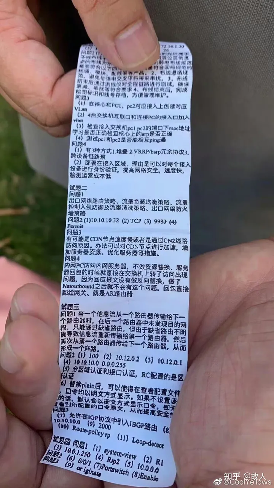

### 新版教材
[2025年将启用新版教材](https://mp.weixin.qq.com/s/6ArU6CV-B-Kh1q1s1RDx4Q)

### 参考答案与解析

[2023年5月网络工程师上午题](https://docs.qq.com/doc/DTndiSXpaS05mQXFJ?groupUin=Zw6qu1HBkT448RPimRMyxQ%253D%253D&ADUIN=532652152&ADSESSION=1685367721&ADTAG=CLIENT.QQ.5681_.0&ADPUBNO=27272&jumpuin=532652152)

[2023年5月网络工程师下午真题](https://docs.qq.com/doc/DTmNLd1R2c2FnSUdp?groupUin=Zw6qu1HBkT448RPimRMyxQ%253D%253D&ADUIN=532652152&ADSESSION=1685198421&ADTAG=CLIENT.QQ.5681_.0&ADPUBNO=27272&jumpuin=532652152)

[2024年上半年网络工程师综合知识真题与答案（考友回忆版，75题全）](https://www.cnitpm.com/pm1/155766iyixk0r65h.html)

[2024年上半年网络工程师上午真题及答案解析](https://www.bilibili.com/opus/937969988120084505)

[2024年上半年网络工程师案例分析真题与答案（考友回忆完整版）](https://www.cnitpm.com/pm1/155771kt2vqir9uq.html)

[2024年上半年网络工程师下午真题及答案解析](https://www.bilibili.com/opus/956165084245131303)

[2025上半年软考网络工程师真题汇总（网友回忆版）](https://www.bilibili.com/opus/1071215670313615378)

[2025年上半年网络工程师综合知识真题答案解析](https://blog.kokojia.com/ruank/b-4110.html)

[2025年上半年网络工程师案例分析真题答案解析](https://blog.kokojia.com/ruank/b-4111.html)
